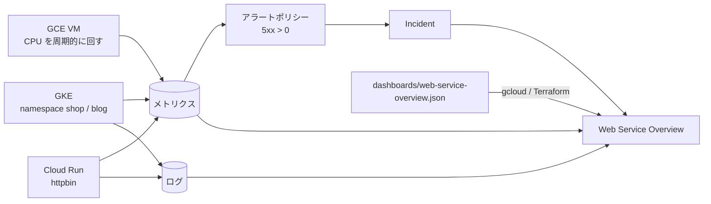

# 29-cloud-monitoring-dashboard

Cloud Monitoring の Custom Dashboard を、**gcloud と Terraform の両方で同じ JSON から作る**。

ダッシュボードに載せるデータの発生源として、GCE・GKE・Cloud Run・アラートポリシーも作る。メトリクスだけでなく、ログ・Incident・変更イベントを1画面に置けるかを見る。

## 何を検証するか

| # | 検証すること |
|---|---|
| 1 | Google Cloud が用意したダッシュボードは API から見えるか |
| 2 | 同じ JSON を gcloud と Terraform の両方に渡せるか |
| 3 | gcloud の update で etag が無い・古いと何が起きるか |
| 4 | Terraform の `dashboard_json` に恒常差分が出るか |
| 5 | リソースに付けた `environment` ラベルで、ダッシュボード全体を絞れるか |
| 6 | Logs パネル・Incident 一覧・イベント注釈に何が出るか |
| 7 | 公式テンプレートの JSON を gcloud で入れられるか |
| 8 | ダッシュボードの操作が監査ログに何を残すか |

## 構成



| リソース | 役割 |
|---|---|
| `google_compute_instance.web` | e2-small の Spot VM。5分ごとに60秒だけ CPU を回す |
| `google_container_cluster.primary` / `google_container_node_pool.primary` | ゾーンクラスタ、e2-medium の Spot ノード1台 |
| `google_service_account.node` / `google_project_iam_member.node` | ノード用のサービスアカウント。`roles/container.defaultNodeServiceAccount` だけを付ける |
| `google_cloud_run_v2_service.api` | `mccutchen/go-httpbin`。`/status/500` で 500、`/delay/1` で1秒遅延 |
| `google_monitoring_alert_policy.run_5xx` | Cloud Run の 5xx が1件でもあれば開く。通知チャネルなし |
| `google_monitoring_dashboard.web` | `dashboards/web-service-overview.json` を渡す |

VM・GKE クラスタ・ノードプール・Cloud Run には `environment=test` のラベルを付ける。

## 前提条件

- Google Cloud CLI、Terraform、kubectl
- Billing が有効な検証用プロジェクト
- 実行元のグローバル **IPv4**（`curl -4 -s https://ifconfig.me`）
- 検証時のバージョン：Terraform 1.14.3、`hashicorp/google` 7.46.1、GKE v1.35.8-gke.1036000、Google Cloud SDK 562.0.0

## 必要な権限（目安）

| 操作 | ロール |
|---|---|
| ダッシュボードの作成・更新・削除 | `roles/monitoring.dashboardEditor` |
| ダッシュボードとグラフのデータを見る | `roles/monitoring.viewer` |
| Logs パネルの中身を見る | 上に加えて `roles/logging.viewer` |
| このサンプル全体の apply | 上に加えて Compute / GKE / Cloud Run / IAM / Service Usage の管理権限 |

`roles/monitoring.dashboardViewer` だけでは時系列を読めず、グラフは空になる（[Access control](https://cloud.google.com/monitoring/access-control)）。

## ファイル構成

```text
29-cloud-monitoring-dashboard/
├── README.md
├── docs/
│   ├── PARAMETER.md                # terraform-docs（自動生成。手動編集しない）
│   └── RESOURCE-PARAMETERS.md      # コンソール / API / Terraform の対応（手書き）
├── DEPENDENCY-GRAPH.svg            # terraform graph（自動生成。手動編集しない）
├── .terraform.lock.hcl
├── dashboards/
│   └── web-service-overview.json   # gcloud と Terraform が共通で読む
├── k8s/
│   └── workloads.yaml              # namespace shop / blog と、落ち続ける crasher
├── scripts/
│   └── load.sh                     # Cloud Run に 200 / 500 / 遅延を混ぜて送る
├── versions.tf
├── provider.tf
├── variables.tf
├── network.tf
├── main.tf
├── alert.tf
├── dashboard.tf
├── outputs.tf
└── terraform.tfvars.example
```

## 使い方

```bash
cp terraform.tfvars.example terraform.tfvars   # project_id と authorized_ipv4_cidr を書く
terraform init
terraform apply
eval "$(terraform output -raw get_credentials)"
kubectl apply -f k8s/workloads.yaml
bash scripts/load.sh "$(terraform output -raw run_url)" 30
```

```text
Apply complete! Resources: 18 added, 0 changed, 0 destroyed.
```

### gcloud で同じダッシュボードを作る

```bash
jq '.displayName="Web Service Overview (gcloud)"' dashboards/web-service-overview.json > gc.json
gcloud monitoring dashboards create --config-from-file=gc.json
gcloud monitoring dashboards list --format='table(name.basename(),displayName)'
```

更新するときは、`describe` で取り直した最新の `etag` を JSON に入れる。

```bash
gcloud monitoring dashboards describe DASHBOARD_ID --format=json > current.json
# current.json を編集する（etag は残す）
gcloud monitoring dashboards update DASHBOARD_ID --config-from-file=current.json
```

## 確認方法

```bash
# Terraform の差分が無いこと（終了コード 0）
terraform plan -detailed-exitcode

# ダッシュボードが作られていること
gcloud monitoring dashboards describe "$(terraform output -raw dashboard_id | awk -F/ '{print $NF}')" \
  --format='value(displayName,labels)'

# Pod と再起動
kubectl get pods -A -l 'app in (web,crasher)'
```

Console の Monitoring > ダッシュボード で `Web Service Overview` を開き、次を確かめる。

- 上部に `environment: test`、`$cluster`、`$namespace` が並ぶ
- Incidents に `tf-adv-dash-api 5xx` が出る
- ERROR logs に Cloud Run の 500 と crasher の `fatal: config file not found` が出る

## 実測結果

### 1. Google Cloud のダッシュボードは API から見えない

Console の一覧では「すべて56件（カスタム3、ハンドブック11、Google サービス42）」だったが、`gcloud monitoring dashboards list` はカスタムの3件だけを返した。API の資料にも、Google Cloud dashboard は「取得・編集・削除できない」とある（[Manage dashboards by API](https://cloud.google.com/monitoring/dashboards/api-dashboard)）。

Google サービスのうち、`VM Instances`・`GKE`・`Firewalls`・`Google Cloud Load Balancers` にはコピーのアイコンが無かった。`Cloud Run Monitoring`・`GKE Cluster Monitoring` などにはあった。

### 2. etag が無い・古い update は拒否される

| 送った JSON | 結果 | 終了コード |
|---|---|---|
| `etag` なし | `INVALID_ARGUMENT: Update Dashboard should specify a non empty etag.` | 1 |
| 古い `etag` | `ABORTED: The supplied etag is not up to date.` | 1 |
| 最新の `etag` | 更新 | 0 |

削除後の `describe` は `NOT_FOUND`（終了コード1）。Dashboards API のメソッドは `create` / `delete` / `get` / `list` / `patch` だけで、削除を取り消す手段は無い。

Terraform 管理のダッシュボードを gcloud で消すと、plan は `has been deleted` を検出して作り直しを提案した。apply で戻るが、ID は新しくなった（`66bacfff-…` → `0217702c-…`）。

### 3. 座標としきい値の 0 で恒常差分になった

API は 0 の座標を省いて返し、xyChart に `targetAxis: "Y1"` を補う。apply 直後の plan は `xPos = 0` を足す差分を出し続けた。JSON から 0 の座標だけを消すと、plan は終了コード 0 になった。`targetAxis` は provider の差分抑制で吸収されるため、書き足す必要はなかった。

スコアカードのしきい値に `"value": 0` を書いた場合も、同じく `+ value = 0` が出続けた。キーごと省くと差分は消えた（しきい値は既定の 0）。

確かめたのは `xPos` / `yPos` / しきい値の `value` の3か所で、`hashicorp/google` 7.46.1 での結果。ほかの項目でも起きうるので、apply のあとに plan で差分が無いことを確かめる。`dashboard.tf` が読む JSON には、この3か所の 0 を書いていない。

### 4. `environment` ラベルで絞れたのは GCE だけ

`metadata.user_labels.environment="test"` で引ける系列の数。

| resource.type | 全系列 | 一致 |
|---|---|---|
| `gce_instance` | 2 | 2（VM と GKE ノード） |
| `k8s_container` | 62 | 0 |
| `cloud_run_revision` | 2 | 0 |

k8s_container は、Pod のラベル（`metadata.user_labels.app="crasher"`）では一致し、クラスタとノードプールに付けた `environment` では一致しなかった。

pinned filter はラベルを持たないウィジェットでは無視される（[資料](https://cloud.google.com/monitoring/dashboards/filter-permanent)）。Console でも、`environment: test` のまま Cloud Run と GKE のグラフにデータが出ていた。

### 5. `severity>=ERROR` だけでは GKE 基盤の Pod のログが大半になった

30分の内訳。GKE では、重大度を明示していない stderr のログは既定で ERROR として取り込まれる。構造化ログで `severity` を明示すればその値が使われる（[About GKE logs の Best practices](https://cloud.google.com/kubernetes-engine/docs/concepts/about-logs#best_practices)）。

```text
   1070 kube-system	fluentbit
    272 kube-system	node-cache
     84 kube-system	core-metrics-exporter
     69 kube-system	gke-metrics-agent
     19 kube-system	autoscaler
     16 shop	nginx
     11 gmp-system	operator
      8 blog	nginx
      3 blog	app
```

JSON の Logs パネルは `kube-system` と `gmp-system` を除外している。

### 6. Cloud Run の更新は、方法によって監査ログのメソッドが違う

```text
google.cloud.run.v2.Services.UpdateService    # terraform apply
google.cloud.run.v1.Services.ReplaceService   # gcloud run services update
```

資料では、Cloud Run deployment のイベントは `ReplaceService` の監査ログから作られるとある（[Event types](https://cloud.google.com/monitoring/dashboards/event-types)）。ただし Console の Cloud Run Monitoring では、19:57 の印に「Cloud Run のデプロイ」が2件並んだ。同じ分の2件では切り分けられないため、Terraform だけで2分あけて2回更新した。監査ログは v2 の `UpdateService` だけで、印も「Cloud Run のデプロイ」が20:52と20:54 JSTに1件ずつ出た。**今回の環境では、Terraform（v2 API）での更新もデプロイとして表示された。** 資料のクエリは v1 の `ReplaceService` なので、Terraform で運用する場合は自分の環境で確かめる。 作成（`CreateService`）の時刻には印が出なかった。

### 7. 変数は参照したウィジェットだけを切り替える

`$namespace` を `blog` にすると、フィルタに `${namespace}` を書いた GKE のメモリと再起動だけが変わった。Cloud Run・GCE・Logs パネル・Incident は変わらなかった。切り替えても `UpdateDashboard` の監査ログは0件で、plan も差分なしだった。

### 8. API で加えた変更もバージョン履歴に載る

Terraform で作成し、1回 apply で更新したダッシュボードの履歴には、2件のリビジョンが並んだ。履歴の JSON には、書いていない既定値（`"filter": ""` など）も展開されていた。

### 9. 公式テンプレートは gcloud で入る

`GoogleCloudPlatform/monitoring-dashboard-samples` のコミット `02e04b0` の `dashboards/google-cloud-run/cloudrun-monitoring.json` を `gcloud monitoring dashboards create` に渡すと、Custom Dashboard として作られた。`dashboardFilters` は `project_id`・`location`・`service_name` の pinned filter、`labels` は空。

## Cloud Logging に残るもの

管理アクティビティの監査ログ（`cloudaudit.googleapis.com%2Factivity`）に、ダッシュボードの作成・更新が残る。

```bash
gcloud logging read 'logName:"cloudaudit.googleapis.com%2Factivity" AND protoPayload.serviceName="monitoring.googleapis.com" AND protoPayload.methodName:"Dashboard"' \
  --freshness=2h \
  --format='table(timestamp,protoPayload.methodName,protoPayload.status.code,protoPayload.request.dashboard.displayName)'
```

| 操作 | 監査ログ |
|---|---|
| 作成（gcloud / Terraform） | `CreateDashboard` が残る |
| 更新 | `UpdateDashboard` が残る |
| 古い etag で拒否された更新 | `UpdateDashboard`、`status.code` 10 で残る |
| etag なしで拒否された更新 | **見つからなかった**（10:43〜10:50 UTC の activity・data_access・system_event を検索） |
| Console で開き、時間範囲と変数を切り替えた | `UpdateDashboard` は0件 |

## 削除方法

```bash
pkill -f 'scripts/load.sh'
# gcloud やテンプレートで作ったダッシュボードは Terraform の管理外
gcloud monitoring dashboards list --format='table(name.basename(),displayName)'
gcloud monitoring dashboards delete DASHBOARD_ID
terraform destroy
```

## 注意 / 費用

- 課金対象：GKE ゾーンクラスタ（管理費）、e2-medium の Spot ノード1台、e2-small の Spot VM 1台、Cloud NAT、Cloud Run（リクエスト時間）。ディスクと通信量も含め、実行前に料金を確認する
- Cloud Logging（ログバケットに保存されるログデータ＝Logging storage。プロジェクトごとに毎月50GiBまで無料）と Cloud Monitoring（API での時系列の読み取り。請求先アカウントごとに毎月100万件まで無料、コンソールからは無料。Cloud Shell から実行したものは除く）にも使用量に応じた料金がある（[Google Cloud Observability pricing](https://cloud.google.com/products/observability/pricing)）
- `disable_on_destroy = false` なので、有効にした API は destroy 後も残る
- `terraform destroy` が消すのは state にあるものだけ。gcloud・テンプレート・Console コピーで作ったダッシュボードは残る
- Cloud Run は `allUsers` に `roles/run.invoker` を付けている。負荷をかけるための検証用の設定で、終わったら destroy する
- **Terraform 管理のダッシュボードを Console で編集しない。** 公式に、編集すると再スケールされるとある。Console では Autosave が既定で ON だった
- `dashboard_json` はキーを削除しただけの変更を plan に出さない（provider の資料）。削除はほかの変更と一緒に行う

## 参考

- [Cloud Monitoring dashboards overview](https://cloud.google.com/monitoring/dashboards)
- [View Google Cloud dashboards](https://cloud.google.com/monitoring/charts/predefined-dashboards)
- [Create and manage custom dashboards](https://cloud.google.com/monitoring/charts/dashboards)
- [Manage dashboards by API](https://cloud.google.com/monitoring/dashboards/api-dashboard)
- [Variables and pinned filters](https://cloud.google.com/monitoring/dashboards/filter-permanent)
- [Dashboard templates](https://cloud.google.com/monitoring/dashboards/dashboard-templates)
- [Display logs on a dashboard](https://cloud.google.com/monitoring/charts/view-logs)
- [Show events on dashboards](https://cloud.google.com/monitoring/dashboards/show-events)
- [Event types](https://cloud.google.com/monitoring/dashboards/event-types)
- [Access control](https://cloud.google.com/monitoring/access-control)
- [google_monitoring_dashboard](https://registry.terraform.io/providers/hashicorp/google/latest/docs/resources/monitoring_dashboard)
- [GoogleCloudPlatform/monitoring-dashboard-samples](https://github.com/GoogleCloudPlatform/monitoring-dashboard-samples)
