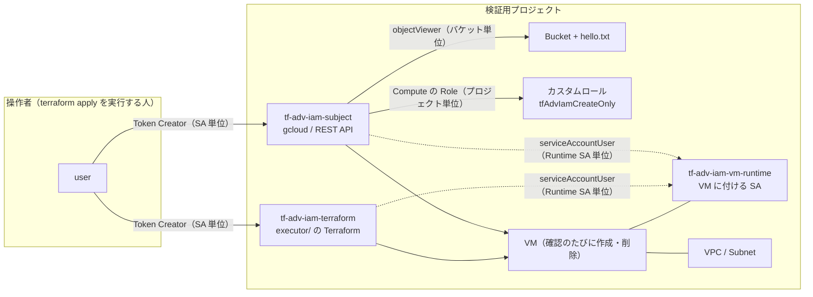

# 30 - IAM 権限の調べ方と最小権限の検証

「この操作にはどの Permission が要るのか」を、公式ドキュメントの Required permissions から始めて、実際に不足させ、原因を特定し、必要な分だけ足して確かめるためのサンプルです。

Role の付与は変数で段階的に切り替えられます。`terraform apply -var=...` で1段ずつ変え、`scripts/` の確認スクリプトで操作の成否を見ます。

## 何を検証するか

| 題材 | 確かめること |
|---|---|
| Cloud Storage のオブジェクト読み取り | バケット単位の `roles/storage.objectViewer` だけで、gcloud と REST API から読めるか。Console が裏で使う `storage.buckets.get` / `storage.buckets.list` は拒否されるか |
| Compute Engine の VM 作成（Runtime SA 付き） | `compute.instances.create` だけでは足りないこと。エラーから関連 Permission を1つずつ見つけ、gcloud と Terraform で最小セットが違うか |
| Runtime SA の `iam.serviceAccounts.actAs` | Runtime SA 単位で付けたときに通ること（プロジェクト単位でも通るが、全 SA が対象になる）。無いときのエラーと監査ログ |
| Policy Troubleshooter | 拒否の理由を、どの階層のどの Role で判定しているか |
| Policy Analyzer | Runtime SA に actAs を持つのは誰か / subject は何を持つか |
| `testIamPermissions` | 呼び出し元が持つ Permission の確認。Resource の種類に合わない Permission を混ぜたときの挙動 |
| IAM Recommender / Policy Simulator | 新規の Principal と、実績のある Principal で結果がどう違うか |

## 構成



## 作成されるGCPリソース

| リソース | 名前 | 内容 |
|---|---|---|
| `google_project_service` | — | IAM / IAM Credentials / Compute / Storage / Cloud Asset / Policy Analyzer / Policy Troubleshooter / Policy Simulator / Recommender |
| `google_service_account` | `tf-adv-iam-subject` | gcloud / REST API で操作する検証用 Principal |
| `google_service_account` | `tf-adv-iam-terraform` | `executor/` の Terraform を実行する Principal |
| `google_service_account` | `tf-adv-iam-vm-runtime` | VM に付ける Runtime SA。Role は付けない |
| `google_service_account_iam_member` | — | 操作者に、subject と terraform の `roles/iam.serviceAccountTokenCreator` |
| `google_storage_bucket` | `<PROJECT_ID>-tf-adv-iam` | 均一なバケットレベルのアクセス、公開アクセス防止 |
| `google_storage_bucket_object` | `hello.txt` | 読み取り対象 |
| `google_compute_network` / `google_compute_subnetwork` | `tf-adv-iam-vpc` / `tf-adv-iam-vpc-subnet` | VM を置く場所 |
| `google_project_iam_custom_role` | `tfAdvIamCreateOnly` | `compute.instances.create` から始め、エラーに出た Permission を足していく測定用ロール |
| 段階的な付与 | — | 下の「変数」を参照 |

`executor/` は別の Root Module です。`tf-adv-iam-terraform` を借用し、Runtime SA 付きの VM `tf-adv-iam-vm-tf` を作ります。

## 前提条件

- Terraform 1.10 以上、`hashicorp/google` 7.x（検証時は 7.46.1）
- 検証用プロジェクトの Owner 相当の権限（SA・カスタムロール・IAM の作成）
- **Owner であっても、それだけでは SA を借用できなかった。** 借用には SA に対する `iam.serviceAccounts.getAccessToken` が要り、`roles/owner` には入っていないため、このサンプルは操作者に SA 単位の Token Creator を付ける

## 変数

| 変数 | 既定値 | 意味 |
|---|---|---|
| `subject_bucket_role` | `""` | subject にバケット単位で付ける Role |
| `subject_compute_role` | `none` | subject にプロジェクト単位で付ける Compute の Role。`none` / `create_only` / `instance_admin` |
| `create_only_extra_permissions` | `[]` | `tfAdvIamCreateOnly` に `compute.instances.create` 以外で足す Permission |
| `subject_can_act_as_runtime` | `false` | subject に Runtime SA の `roles/iam.serviceAccountUser` を付けるか |
| `terraform_compute_role` / `terraform_can_act_as_runtime` | `none` / `false` | Terraform 実行 SA 向けの同じ切り替え |
| `console_member` / `console_bucket_role` / `console_project_role` | `""` | Console の差を確かめる専用ユーザーへの付与。**普段使いの強い権限を持つユーザーを指定しない** |

## ファイル構成

```text
30-iam-permission-investigation/
├── README.md
├── docs/
│   └── PARAMETER.md                  # terraform-docs（自動生成。手動編集しない）
├── DEPENDENCY-GRAPH.svg              # terraform graph（自動生成。手動編集しない）
├── versions.tf
├── provider.tf
├── variables.tf
├── main.tf
├── network.tf
├── outputs.tf
├── terraform.tfvars.example
├── scripts/
│   ├── verify-storage.sh             # gcloud と REST API で読む。バケット一覧・取得も試す
│   ├── verify-compute.sh             # Runtime SA 付きの VM を gcloud で作る（成功したら削除）
│   └── test-iam-permissions.sh       # testIamPermissions。最後に1回だけ実行する
└── executor/                         # Terraform 実行 SA を借用して VM を作る Root Module
    ├── versions.tf
    ├── main.tf
    └── terraform.tfvars.example
```

## 使い方

```bash
cd Advanced-Examples/30-iam-permission-investigation
cp terraform.tfvars.example terraform.tfvars   # project_id と operator_member を埋める
terraform init
terraform apply
```

最初の apply では、検証用 Principal に Role を1つも付けません。以降は `terraform.tfvars` の付与を1段ずつ変えて apply し、確認スクリプトを実行します。

**IAM の変更はすぐには効きません。** 公式には「通常2分、7分以上かかることもある」とあります（[Access change propagation](https://cloud.google.com/iam/docs/access-change-propagation)）。変更直後の失敗は、反映待ちの可能性を先に疑ってください。

## 確認方法と実測結果

### 1. Cloud Storage

```bash
bash scripts/verify-storage.sh <PROJECT_ID>
```

| 操作 | 必要な Permission | Role なし | バケット単位の `objectViewer` |
|---|---|---|---|
| `gcloud storage cat` / REST `objects.get` | `storage.objects.get` | 403 | 成功 |
| `gcloud storage ls gs://BUCKET` | `storage.objects.list` | 403 | 成功 |
| `gcloud storage buckets describe` / REST `buckets.get` | `storage.buckets.get` | 403 | **403** |
| `gcloud storage ls`（一覧） / REST `buckets.list` | `storage.buckets.list`（プロジェクト） | 403 | **403** |

エラーには、不足している Permission の名前がそのまま出ます。

```text
ERROR: (gcloud.storage.buckets.describe) [tf-adv-iam-subject@YOUR_PROJECT_ID.iam.gserviceaccount.com] does not have permission to access b instance [YOUR_PROJECT_ID-tf-adv-iam] (or it may not exist): tf-adv-iam-subject@YOUR_PROJECT_ID.iam.gserviceaccount.com does not have storage.buckets.get access to the Google Cloud Storage bucket. Permission 'storage.buckets.get' denied on resource '//storage.googleapis.com/projects/_/buckets/YOUR_PROJECT_ID-tf-adv-iam' (or it may not exist).
```

公式の [Read objects](https://cloud.google.com/storage/docs/reading-objects) は、Console で読む場合にだけ、バケット一覧と取得のためにプロジェクト単位の `roles/storage.admin` を挙げています。

### 1-2. Cloud Storage（Console）

**Console は、人のアカウントでログインして確かめます。** 強い権限を持つ普段のユーザーで試すと、どの Permission で動いたのかが分かりません。組織やフォルダ、グループから継承している権限が無いことを、先に Policy Analyzer で確かめてください。

```bash
gcloud asset analyze-iam-policy --organization=ORG_ID \
  --identity=user:CONSOLE_USER@example.com --expand-groups
```

検証では、作ったユーザーが組織レベルの Billing 管理者グループに入っていました。そのグループの `roles/billing.admin` には `resourcemanager.projects.get` / `list` が入っているため、グループから外してから測りました。

`console_member` に専用ユーザーを指定し、`console_bucket_role` → `console_project_role` の順に足して、同じ画面を開きました。

| 画面 | Role なし | バケット単位の `objectViewer` | + プロジェクト単位の `storage.bucketViewer` |
|---|---|---|---|
| プロジェクトのダッシュボード | `resourcemanager.projects.get` が無いと表示 | 同左 | 同左 |
| バケット一覧 | `storage.buckets.list` が無いと表示 | 同左 | **表示される** |
| バケットの中身（URL を直接開く） | `storage.objects.list` のエラーと、空のバケットの案内が同時に出る | `hello.txt` が出る | 一覧から辿れる。ロケーションなどの見出しも出る |
| オブジェクトの詳細 | `storage.objects.get` が無いと表示 | 表示される。公開状態を確かめられないという注意が出る | 表示される。公開アクセスが「非公開」と出る |
| ダウンロード | — | できる | できる |
| プロジェクトの選択 | — | — | 検証用プロジェクトは候補に出ない |

**一覧から辿って Console でオブジェクトを読むには、`objectViewer`（バケット）と `storage.bucketViewer`（プロジェクト）で足りました。** `roles/storage.bucketViewer` は `storage.buckets.get` / `storage.buckets.list` の2つだけを持つ Role です（検証時点で BETA）。Console のエラー画面も、`storage.buckets.list` が無いときの候補の先頭にこの Role を挙げていました。

**権限が無いときのバケット画面は、空のバケットに見えます。** 赤いエラー帯の下に「表示する行がありません」「バケットの準備ができました。データを追加してください。」が出ました。0件をそのまま読まないでください。

オブジェクトの詳細には、権限が無くても「メタデータを編集」「削除」のボタンが表示されました。ボタンが見えることは、操作できることを意味しません。

プロジェクトのダッシュボードは最後まで「追加のアクセス権が必要です」のままで、「プロジェクトの選択」にも検証用プロジェクトは出ませんでした。`roles/storage.objectViewer` には `resourcemanager.projects.get` / `list` も入っていますが、バケットに付けたためプロジェクトには効いていません。**同じ Role でも、付けた場所で効く範囲が変わります。** Storage の操作そのものには要りませんでしたが、利用者がプロジェクトから辿る運用なら、プロジェクトに対する閲覧権限を別に検討します。

Console の操作も API 呼び出しとして `storage.googleapis.com/api/request_count` に残りました。Role が無いときは `ListObjects` の `PERMISSION_DENIED`、付与後は `ListObjects` / `ReadObject` の `OK` です。

### 2. Compute Engine（gcloud）

```bash
bash scripts/verify-compute.sh <PROJECT_ID>
```

`subject_compute_role = "create_only"` から始め、エラーに出た Permission を `create_only_extra_permissions` に1つずつ足しました。**エラーに出る不足 Permission は、毎回1つだけ**でした。

| 段階 | カスタムロールの中身（`compute.instances.create` に加えて） | 結果 |
|---|---|---|
| C0 | なし | `Required 'compute.disks.create' permission` |
| 1 | `disks.create` | `Required 'compute.subnetworks.use' permission` |
| 2 | + `subnetworks.use` | `Required 'compute.instances.setServiceAccount' permission` |
| 3 | + `instances.setServiceAccount` | `The user does not have access to service account ...`（actAs） |
| C3 | + Runtime SA の `serviceAccountUser` | **VM は作成されたが exit=1。** `Required 'compute.instances.get' permission` |
| C4 | + `instances.get` | 成功（exit=0） |

actAs の不足だけは書式が違い、Permission 名ではなく Role 名で案内されます。

```text
ERROR: (gcloud.compute.instances.create) Could not fetch resource:
 - The user does not have access to service account 'tf-adv-iam-vm-runtime@YOUR_PROJECT_ID.iam.gserviceaccount.com'.  User: 'tf-adv-iam-subject@YOUR_PROJECT_ID.iam.gserviceaccount.com'. Ask a project owner to grant you the iam.serviceAccountUser role on the service account.
```

C3 では、gcloud が作成後の表示に `compute.instances.get` を使うため、**VM ができたのにコマンドは失敗で終わりました。** 失敗したコマンドの後にリソースが残ることがあるので、`gcloud compute instances list` を管理者で確かめてください。

公式の Required permissions（[Create a VM that uses a user-managed service account](https://cloud.google.com/compute/docs/access/create-enable-service-accounts-for-instances)）は「サブネットを指定するなら `compute.subnetworks.use`」「ラベルを付けるなら `compute.instances.setLabels`」のような条件付きの一覧です。`compute.instances.get` は一覧にありません。actAs は [Attach service accounts to resources](https://cloud.google.com/iam/docs/attach-service-accounts) に、SA 単位の `roles/iam.serviceAccountUser` として書かれています。

`roles/compute.instanceAdmin.v1` には上の Compute の Permission がすべて入っていますが、`iam.serviceAccounts.actAs` は入っていません。`instance_admin` に切り替えても、Runtime SA への付与が無ければ同じ actAs のエラーで止まります。

### 3. Compute Engine（Terraform）

```bash
cd executor
cp terraform.tfvars.example terraform.tfvars
terraform init
terraform apply
terraform destroy
```

gcloud の最小セット（C4）を `tf-adv-iam-terraform` に付けて実行しました。

| 操作 | 追加で要求された Permission |
|---|---|
| `terraform apply` | `compute.instances.setLabels` |
| `terraform plan`（作成後） | なし（`No changes.`） |
| `terraform destroy` | `compute.instances.delete` |

`setLabels` が要るのは、provider が `goog-terraform-provisioned = "true"` ラベルを自動で付けるためです。plan の出力に現れます。

```text
      + effective_labels     = {
          + "goog-terraform-provisioned" = "true"
        }
```

Terraform で作成から削除まで通したのは、次の7つと Runtime SA の actAs でした。gcloud から引き継いだ4つ（`disks.create` / `subnetworks.use` / `instances.setServiceAccount` / `instances.get`）は、1つずつ外すとそれぞれの名前で拒否されることを確かめています（外したあと、Terraform 実行 SA の `testIamPermissions` から消えるのを待ってから実行）。`instances.create` と actAs は Terraform では外して試していません。

```text
compute.instances.create
compute.disks.create
compute.subnetworks.use
compute.instances.setServiceAccount
compute.instances.get
compute.instances.setLabels
compute.instances.delete
```

**この一覧は、このサンプルの VM 設定（新規ディスク・公開イメージ・サブネット指定・外部 IP なし・Runtime SA あり）での結果です。** 外部 IP・メタデータ・ネットワークタグ・既存ディスクを使えば、公式の一覧にある別の Permission が加わります。

### 4. Policy Troubleshooter

C1（`instance_admin`、actAs なし）の状態で、actAs の失敗を調べました。

```bash
gcloud policy-intelligence troubleshoot-policy iam \
  //iam.googleapis.com/projects/YOUR_PROJECT_ID/serviceAccounts/tf-adv-iam-vm-runtime@YOUR_PROJECT_ID.iam.gserviceaccount.com \
  --principal-email=tf-adv-iam-subject@YOUR_PROJECT_ID.iam.gserviceaccount.com \
  --permission=iam.serviceAccounts.actAs
```

| 評価した Policy | C1（付与前） | C2（Runtime SA に `serviceAccountUser`） |
|---|---|---|
| Runtime SA | `NOT_GRANTED`（該当なし） | **`GRANTED`**（`roles/iam.serviceAccountUser`） |
| プロジェクト | `NOT_GRANTED`（`compute.instanceAdmin.v1` は `ROLE_PERMISSION_NOT_INCLUDED`） | 同左 |
| フォルダ / 組織 | `NOT_GRANTED` | `NOT_GRANTED` |
| 総合 | `CANNOT_ACCESS` | `CAN_ACCESS` |
| Deny | `DENY_ACCESS_STATE_NOT_DENIED` | 同左 |

バージョン指定なしのこのコマンドは Allow と Deny を、`beta` を付けると Principal Access Boundary も評価します（[Troubleshoot IAM permissions](https://cloud.google.com/policy-intelligence/docs/troubleshoot-access)）。旧来の `gcloud policy-troubleshoot iam` も同じ判定を返しましたが、`errors` に `Failed to generate IAM deny explanation` が付き、Deny の説明はありませんでした。

gcloud のエラーには Troubleshooter の URL（`errorId` 付き）が含まれることがあります。SA 借用の反映待ちで失敗したときに出ました。

### 5. Policy Analyzer

```bash
# Runtime SA に actAs を持つのは誰か
gcloud asset analyze-iam-policy --project=YOUR_PROJECT_ID \
  --full-resource-name=//iam.googleapis.com/projects/YOUR_PROJECT_ID/serviceAccounts/tf-adv-iam-vm-runtime@YOUR_PROJECT_ID.iam.gserviceaccount.com \
  --permissions=iam.serviceAccounts.actAs

# subject は何を持つか
gcloud asset analyze-iam-policy --project=YOUR_PROJECT_ID \
  --identity=serviceAccount:tf-adv-iam-subject@YOUR_PROJECT_ID.iam.gserviceaccount.com
```

C1 の状態で、Runtime SA に actAs を持っていたのはプロジェクト単位の Owner・Editor（デフォルトの Compute SA など）・Service Agent 4種で、subject はいませんでした。**Editor を持つ Principal は、プロジェクト内のどの SA にも actAs できます。** subject の結果はバケットの `objectViewer` とプロジェクトの `compute.instanceAdmin.v1` の2件でした。

Policy Analyzer が分析するのは Allow Policy だけで、Deny Policy などは含みません。組織あたり1日20クエリまで無料です（[Policy Analyzer for allow policies](https://cloud.google.com/policy-intelligence/docs/policy-analyzer-overview)）。

### 6. testIamPermissions

```bash
bash scripts/test-iam-permissions.sh <PROJECT_ID>
```

**実操作と Troubleshooter が終わってから、最後に実行します。** `testIamPermissions` でテストした Permission は、IAM Recommender では使用したものとして数えられます（[Role recommendations](https://cloud.google.com/policy-intelligence/docs/role-recommendations-overview)）。

結果は付与した Role と一致しました（プロジェクトに対して7件、Runtime SA に対して `iam.serviceAccounts.actAs`、バケットに対して `storage.objects.get` / `storage.objects.list`）。

**バケットの testPermissions に `storage.buckets.list` を1つでも含めると、リクエスト全体が 400 `Invalid argument.` になりました。** `storage.buckets.list` はプロジェクトに対する Permission なので、プロジェクトの `testIamPermissions` に入れます。

### 7. IAM Recommender と Policy Simulator

```bash
gcloud recommender recommendations list --project=YOUR_PROJECT_ID --location=global \
  --recommender=google.iam.policy.Recommender
gcloud recommender insights list --project=YOUR_PROJECT_ID --location=global \
  --insight-type=google.iam.policy.Insight
gcloud iam simulator replay-recent-access \
  //cloudresourcemanager.googleapis.com/projects/YOUR_PROJECT_ID proposed-policy.json
```

| | 結果 |
|---|---|
| Recommender の推奨 | 0件 |
| Insight | 既存の Principal 3件だけ（Editor 2件、Owner 1件）。今回作った SA は無し |
| Simulator: subject のカスタムロールを外す | 差分0件 |
| Simulator: デフォルト Compute SA の Editor を外す | `ACCESS_REVOKED` 3件（`monitoring.timeSeries.create` / `autoscaling.sites.writeMetrics` / `logging.logEntries.create`） |

今回の SA に推奨も Insight も出なかった理由には、公式に書かれた2つの条件が関わりえます（[Role recommendations](https://cloud.google.com/policy-intelligence/docs/role-recommendations-overview)）。

- 観測期間: 最小観測期間は既定で90日（プロジェクト単位なら30日か60日に変更可）。新しく付けた Role の Insight 生成には最大15日かかる
- 利用条件: basic Role（Owner / Editor / Viewer）以外の Role への推奨、プロジェクト以外（バケットなど）に付けた Role への推奨、Policy insights は、Security Command Center の Premium / Enterprise をプロジェクトか組織のレベルで有効にしたときの機能とされている

subject に付けたのはカスタムロールとバケット単位の `objectViewer` で、Insight が出ていたのも basic Role の3件だけでした。検証環境で SCC Premium / Enterprise が有効かは確かめていないため、**0件の原因を観測期間と利用条件のどちらかには絞れません。** カスタムロールなどの見直しに Recommender を使うなら、先に SCC の階層を確かめてください。

`ACCESS_REVOKED` の3件は、過去に観測されたアクセスを変更後の Policy で評価し直した結果です。観測されていないアクセスは分からないため、Editor を外す前の判断材料の1つとして扱います。

Simulator が再生したアクセスログは676件で、**最新の日付は検証日の10日前**でした。当日の subject の操作は含まれておらず、差分0件は「外しても安全」という意味ではありません。エラーは359件あり、大半は `Permission denied (or resource does not exist) when getting policy` でした。権限不足か不存在かはメッセージから区別できませんが、確かめた範囲では対象は過去の検証で削除した VM でした。

`gcloud iam simulator replay-recent-access` は `etag` の無い Policy を渡すと `Replace existing policy (Y/n)?` と尋ねますが、シミュレーションであり、実行後も IAM Policy の etag は変わっていませんでした。

## Cloud Logging に残るもの

| 操作 | 残るか | 見つけ方 |
|---|---|---|
| Compute の拒否（`instances.insert` / `delete`） | 残る（Admin Activity、`status.code=7`） | `protoPayload.status.code=7` |
| actAs が無いときの VM 作成 | 残る。ただし **`status.code=3`**（`SERVICE_ACCOUNT_ACCESS_DENIED`） | `code=7` では見つからない |
| actAs の判定そのもの | 残る。`iam.serviceAccounts.actAs` のエントリーで `status` は空、`authorizationInfo.granted=false` | `protoPayload.authorizationInfo.granted=false` |
| Cloud Storage の読み取り・拒否 | 今回は**残らなかった**（0件） | Data Access 監査ログを有効にしていないため |
| SA 借用の成功（`GenerateAccessToken`） | data_access に残った | `protoPayload.methodName="GenerateAccessToken"` |
| SA 借用の拒否 | **残らなかった**（0件） | — |
| IAM の変更 | 残る（`SetIamPolicy` / `CreateRole` / `UpdateRole`） | `protoPayload.methodName:"SetIamPolicy"` |

`GenerateAccessToken` の成功が data_access に残ったのは、公式の記述と合いません。公式には、このメソッドは `DATA_READ` で、IAM API の Data Access 監査ログを有効にしたときに記録されるとあります（[Service Account Credentials API audit logging](https://cloud.google.com/iam/docs/audit-logging/audit-logging-iamcreds)）。検証環境ではプロジェクト・フォルダ・組織のいずれにも `auditConfigs` は設定されていませんでしたが、成功の記録は残りました。理由は確かめられていません。

**拒否を探すなら `status.code=7` だけでは足りません。** actAs の不足は `code=3` で記録され、判定は別のエントリーに `granted=false` として残ります。

## メトリクス

`serviceruntime.googleapis.com/api/request_count` は、`credential_id` と `method` ごとに 403 を数えます。監査ログに残らない読み取り系の拒否も見えます。

| Principal | 見えた 403 | 操作の結果 |
|---|---|---|
| subject（gcloud、最小の組み合わせで作成・削除を1回） | `ZonesService.Get` 1回（`Insert` / `Get` / `Delete` / `Wait` は200） | 作成も削除も成功していた |
| subject（gcloud） | `InstancesService.AggregatedList` 1回 | `instances list` は `Listed 0 items.` と警告を出して終わった |
| Terraform 実行 SA | `DisksService.Get` 4回、`InstancesService.Get` 1回 など | apply は成功していた |

**最小セットで操作が成功しても、ツールの内部では拒否されている呼び出しがあります。**

Cloud Storage は `storage.googleapis.com/api/request_count` の `response_code=PERMISSION_DENIED` にメソッド別で出ました。監査ログには0件だったので、今回見つかった痕跡はこれだけです。ただし誰が拒否されたかは分かりません。

`iam.googleapis.com/service_account/authn_events_count` には、借用（`GenerateAccessToken`）でだけ使った subject と Terraform 実行 SA の系列が、検証から9日後に引き直しても0件でした。同じプロジェクトでは、ほかの SA の系列が6週間で37本記録されています。公式の説明は「サービスアカウントの認証イベント数。600秒ごとにサンプリングし、最大10800秒見えない」で（[Google Cloud metrics](https://cloud.google.com/monitoring/api/metrics_gcp_i_o)）、借用を数えるかどうかは書かれていません。

## 削除方法

```bash
cd executor && terraform destroy   # VM が残っている場合
cd .. && terraform destroy
```

削除後に確かめるもの。

```bash
gcloud projects get-iam-policy <PROJECT_ID> --format=json | grep tf-adv-iam
gcloud iam service-accounts list --project=<PROJECT_ID> | grep tf-adv-iam
gcloud iam roles list --project=<PROJECT_ID> --show-deleted | grep tfAdvIam
gcloud compute instances list --project=<PROJECT_ID>
gcloud storage buckets list --project=<PROJECT_ID>
gcloud asset search-all-resources --scope=projects/<PROJECT_ID> --query="name:tf-adv-iam"
```

**カスタムロールは削除後もすぐには消えません。** 7日以内なら復元でき、完全に削除されて同じ ID で作り直せるようになるのは、削除の要求から最大44日後です（[Create and manage custom roles](https://cloud.google.com/iam/docs/creating-custom-roles)）。再検証では `role_id` を変えてください。

## 注意点 / 費用

- VM は確認のたびに作成・削除する `e2-micro` です。バケットとオブジェクトの料金はごくわずかです
- Policy Analyzer は組織あたり1日20クエリを超えると Security Command Center の Premium / Enterprise を組織レベルで有効にする必要があります
- デフォルトの Compute SA が Editor を持つプロジェクトでは、その SA を付けたリソースを作れる Principal に広い権限が渡ります。このサンプルは専用の Runtime SA を使います
- Owner・Editor を「動作確認のため」に付けないでください。どこで拒否されるかが見えなくなります
- Service Agent の Role を Service Agent 以外に付けないでください（[Service agents](https://cloud.google.com/iam/docs/service-agents)）

## 参考

- [Access change propagation](https://cloud.google.com/iam/docs/access-change-propagation)
- [Read objects](https://cloud.google.com/storage/docs/reading-objects)
- [Create a VM that uses a user-managed service account](https://cloud.google.com/compute/docs/access/create-enable-service-accounts-for-instances)
- [Attach service accounts to resources](https://cloud.google.com/iam/docs/attach-service-accounts)
- [Troubleshoot IAM permissions](https://cloud.google.com/policy-intelligence/docs/troubleshoot-access)
- [Policy Analyzer for allow policies](https://cloud.google.com/policy-intelligence/docs/policy-analyzer-overview)
- [Test permissions](https://cloud.google.com/iam/docs/testing-permissions)
- [Role recommendations](https://cloud.google.com/policy-intelligence/docs/role-recommendations-overview)
- [Test role changes with Policy Simulator](https://cloud.google.com/policy-intelligence/docs/simulate-iam-policies)
- [Service Account Credentials API audit logging](https://cloud.google.com/iam/docs/audit-logging/audit-logging-iamcreds)
- [Service agents](https://cloud.google.com/iam/docs/service-agents)
